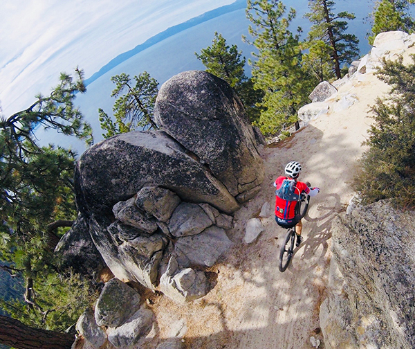

## About Me

Currently a senior at Utah Valley University studying website & application design and development. Outside of school and work most of my hobbies involve things with two wheels, motorcycles, road bikes, mountain bikes etc. If I'm not working on developing websites, I'm probably doing one of the latter.

Something I think I do well with, is understanding front end development. Not necessarily just how to code it, but easily being able to see patterns and structures in a design then knowing how implement it. Something that I could work on is for sure backend development. I really enjoy structuring and organizing frontends, but connecting servers, databases, and everything all together isn't my strong suit. 

My favorite part about web development is structuring the site, whether it’s how data is organized in the database, or how info is organized on the frontend. I enjoy trying to make things more intuitive for people so anything related to organization and structure is something I typically enjoy.

Something I’m hoping to get out of this class is a better understanding of both Javascript and frameworks. I’ve used both enough to where I feel comfortable, but not quite super confident yet.

 

### Contact me

[lbuibel@gmail.com](mailto:lbuibel@gmail.com)